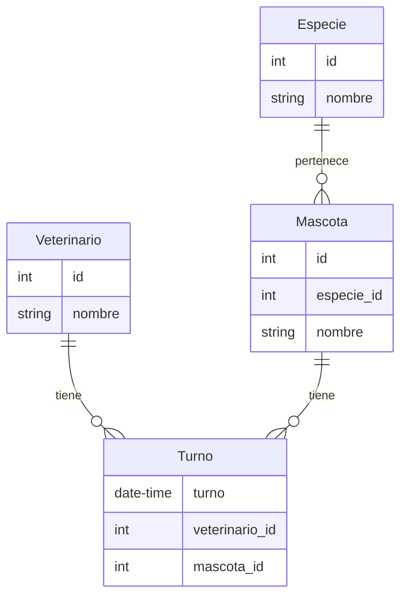

Diagrama Entidad-Relación
=========================

Consultar la documentación de [Mermaid](https://github.com/mermaid-js/mermaid) sobre [Entity Relationship Diagrams](https://mermaid.js.org/syntax/entityRelationshipDiagram.html).

Para visualizar el siguiente diagrama se puede usar el [editor online](https://mermaid.live/).

